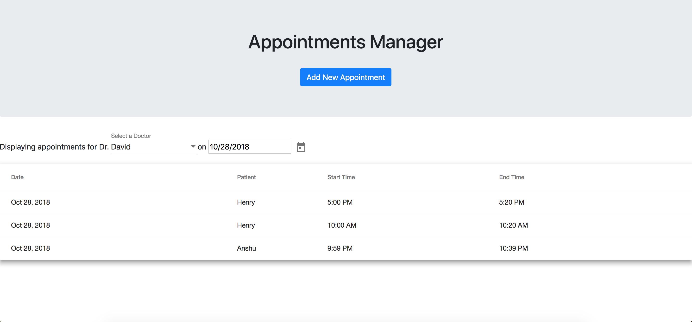

# Appointments Manager

This is an Appointments Manager web-app, written for Cedar, as a 4-5 hour coding project. It was constructed as two disjoint parts – a NodeJS server (located in ./server), and an Angular/Typescript client (located in ./appointments-client). 



## Getting Started

### Prerequisites

This is a Node.JS/Angular app, using MongoDB. In order to run them, you should have NodeJs/NPM installed, as well as a local MongoDB instance running. 

### Installing

Navigate to the server directory, and run

```
npm install
```

After that, run 
```
npm start
```

To start the server. 

To start the client, navigate to the appointments-client directory, and run

```
npm install
```

Following that, run 
```
ng serve
```
and go to http://localhost:4200 to access the application. 

## Running the tests

Both the server and client have tests. In both of their directories, run
```angular2html
npm test
```
to run the test suite.

## Built With

* [NodeJs](https://nodejs.org/en/)
* [ExpressJs](https://expressjs.com/)
* [Angular](https://angular.io)
* [Typescript](https://www.typescriptlang.org/)

## Authors

* **David Freilich** - [LinkedIn](https://www.linkedin.com/in/davidfreilich/)

## License

This project is licensed under the MIT License. 

## Assumptions
To construct the app within the time-frame provided, I made a few assumptions. 
* We would be constructing a web-app, rather than a native application
* The web-app would be focused for a receptionist, and as such, it didn't have to deal with authentication, or heavy usage. Similarly, it would also be able to operate for now with a local database.
* As was discussed during my systems interview, the patient and doctor information would be imported directly into the database, so there was no need to allow for adding doctor/patient data. 
* The MVP was to display and add appointments, with editing/deleting appointments as a further step. 
 
## Next Steps
There are many ways to improve upon this app (see the TODO notes scattered throughout the files), but some next steps I would take are:
* Rounding out the test coverage, to ensure that it is tested much more rigorously
* Enabling editing and deletion of appointments
* Give clearer/more thorough error handling throughout
* Enable a portal for adding doctor or patient entries. 
* Create a login and authentication, to ensure that proper users are accessing what they are supposed to. 
* Using Swagger to generate API documentation, to enable ease of further development. 